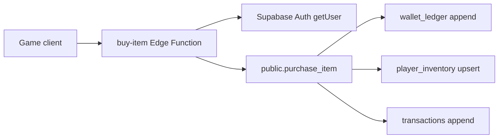
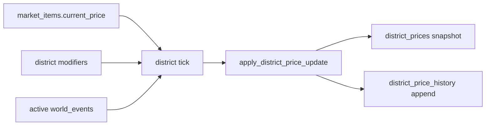
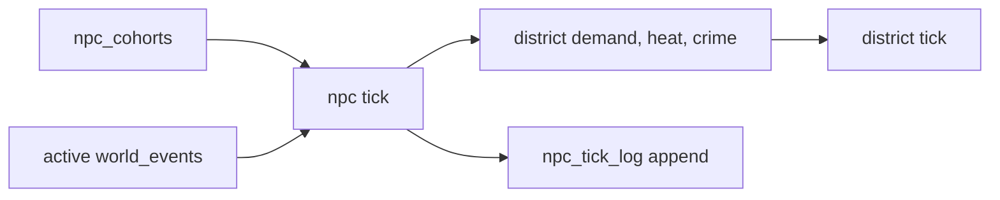

# Architecture

## Principle

Vice Economy Engine is server-authoritative. Clients send intent; the database and trusted server code decide whether money changes.

## Phase 1 Components

- Supabase Auth supplies player identity.
- PostgreSQL stores economy state.
- RLS limits client reads to owned rows.
- The wallet ledger is the source of truth for money changes.
- Market catalog tables are client-readable but not client-writable.

## Money Model

Money is represented as immutable clean-cash deltas in `wallet_ledger`.

The current wallet balance is exposed through the read-only `wallet_balances` view, which sums `delta_amount` for the authenticated player under the underlying table RLS policies. Dirty cash is intentionally deferred until the dirty-money phase.

Client applications must never update balances directly. Future purchase, sale, and laundering flows must write ledger entries through trusted RPCs or Edge Functions.

## Purchase Flow

`public.purchase_item` is the Phase 2 RPC entrypoint. It validates `p_player_id` against `auth.uid()` and delegates to a private security-definer implementation.

The implementation uses a transaction-scoped advisory lock keyed by player ID, then locks the selected market item row. This serializes purchases for the same player while still allowing different players to purchase concurrently.

## Edge Function Layer

`POST /functions/v1/buy-item` is the Phase 3 client-facing purchase endpoint.

The function validates the caller's JWT, derives `player_id` from Supabase Auth, validates only `item_id` and `quantity` from the request body, and forwards the caller's `Authorization` header when invoking `purchase_item`. That preserves the database-level `auth.uid()` check inside the RPC.

## Economy Engine

The Phase 4 economy engine is a Node.js service intended for Railway. It exposes:

- `GET /health`: public readiness check.
- `POST /tick/market`: protected by `x-tick-secret`.
- `POST /tick/launder`: protected dirty-money completion tick.
- `POST /tick/district`: protected district-price tick.
- `POST /tick/npc`: protected NPC cohort simulation tick.
- `POST /tick/all`: protected combined market, district, and laundering tick.

The engine uses the Supabase service-role key because it is a trusted server worker, not a client proxy. It writes market price changes directly and records every change in `market_price_history` with a shared `tick_id`.

## Audit Layer

Phase 5 adds `audit_events` and `system_jobs`.

`wallet_ledger` and `transactions` inserts are mirrored into `audit_events` by database triggers. This keeps money mutation audit inside Postgres, not inside application code.

The economy engine writes a `system_jobs` row for each `/tick/market` run, then marks it `completed` or `failed`. Price changes remain grouped by `market_price_history.tick_id`.

## Dirty Money

Dirty money is stored in the same immutable `wallet_ledger` as clean cash, distinguished by `currency = 'cash_dirty'`.

Players start laundering through `start_laundering`, which immediately inserts a negative dirty-cash ledger row and creates a pending `laundering_jobs` record. The economy engine later calls `complete_laundering` through `/tick/launder`; only then does the player receive clean cash, net of fees.

## District Economy

Phase 7 adds `districts`, `world_events`, `district_prices`, and `district_price_history`.

District prices are snapshots derived from global market prices plus local economic pressure. The engine runs `/tick/district`, reads active world events whose time window contains the current tick, calculates district-specific prices, and calls `apply_district_price_update` for each changed item. The database upserts the district price and appends history in one transaction.

## NPC Cohorts

Phase 8 adds `npc_cohorts` and `npc_tick_log`.

NPC simulation is aggregated by district and cohort type, not individual NPC rows. The engine runs `/tick/npc`, computes population-weighted fear, wealth, criminal presence, demand-profile pressure, and active world-event fear deltas, then updates district `demand_multiplier`, `crime_pressure`, and `heat_level` through `apply_npc_district_update`.

The NPC tick intentionally changes district conditions instead of directly changing item prices. The next district tick translates those conditions into district-specific prices.

## Trust Boundaries

- Browser or game client: untrusted.
- Supabase RLS: defensive wall for user-scoped reads.
- Service role callers: trusted server path only.
- Database functions: transaction-safe authority for money changes in later phases.
